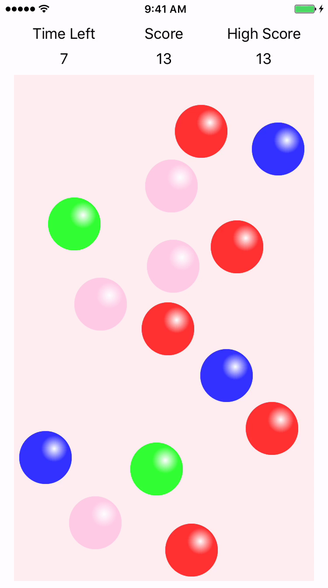
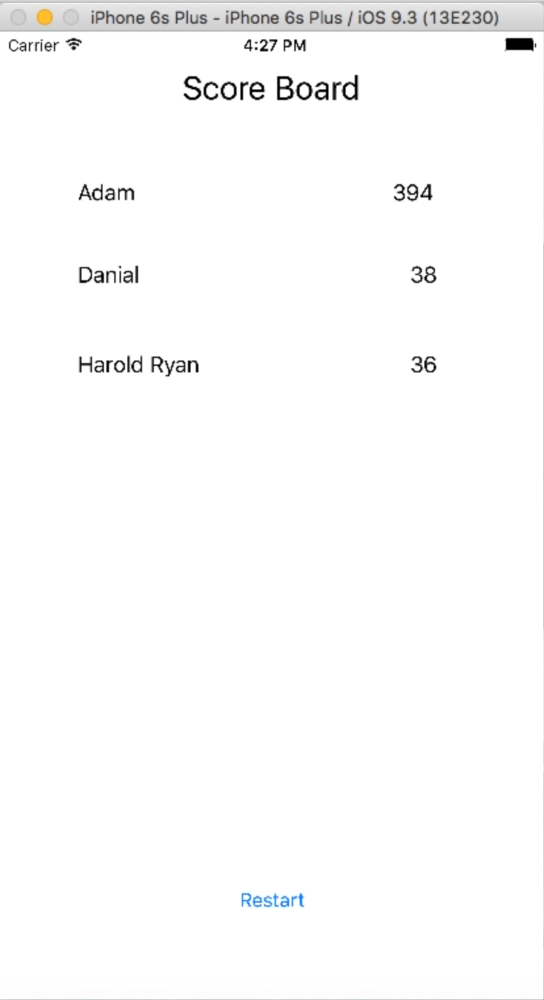

Faculty of Engineering and Information Technology School of Software

41889 - Application Development in the iOS Environment 42889 - iOS Application Development Autumn 2018

# Assessment Task 2

Individual programming project: **BubblePop** Game

Due 10 May 2019 at 11:59 pm

This project is worth 30% of the overall mark for this subject.

GitHub Classroom invitation: https://classroom.github.com/a/923tJIQR

## Introduction

A client has just hired you to develop a casual iOS game based on an idea he had recently. He has no programming experiences and only knows the overall functions the game must have. You must help him to work out a detailed Graphical User Interface (GUI), design a well-structured program and implement the program in the Swift programming language. The final product shall be thoroughly tested and ready to be submitted to the App Store.

|  |  |
| --------------------------------------------- | ----------------------------------------------- |
| Figure 1. Gameplay Mockup                     | Figure 2. Scoreboard Mockup                     |

## Objectives

The purpose of this project is to demonstrate competence in the following skills:

- [ ] The full software development cycle
- [ ] iOS App UI and program design
- [ ] iOS UI programming
- [ ] Effective use of platform APIs
- [ ] Program testing

## Functionality Specification

The game is called **BubblePop** (you can call your app a different name if you wish to). In this game, a number of bubbles are randomly displayed on an iOS device screen. A player pops a bubble by touching the bubble, and every time they pop a bubble they earn a certain number of points. Bubbles come in five colours: red, pink, green, blue and black. Each colour corresponds to a specific number of points and has a specific probability of appearance (see table 1). All bubbles appear on the screen briefly (see core functionality 9). A player needs to pop as many bubbles as possible within a certain timeframe (default to 60 seconds) to get high scores. Note that, if a player pops two or more bubbles of the same colour consecutively, they earn 1.5 times the points for the additional bubbles they pop. Finally, game scores are saved and a high score board is displayed after a game run is finished. Figure 1 provides a rough mock up of what the main interface may look like. **NOTE**: Figure 1 gives you a guide for your GUI, you may design a more sophisticated and more polished GUI for your own work. You will get 1 functionality mark for each functionality item specified below.

| Colour | Game Points | Probability of Appearance |
| :----: | ----------: | ------------------------: |
|  Red   |           1 |                       40% |
|  Pink  |           2 |                       30% |
| Green  |           5 |                       15% |
|  Blue  |           8 |                       10% |
| Black  |          10 |                        5% |

> Table 1. Specifications for coloured bubbles

**Core Functionalities**

1. A player must be able to enter their name before the start of a game run. (You may load the player's name from the [GameKit API](https://developer.apple.com/reference/gamekit/gkplayer) if you wish. This extra work is not required.)
2. A game timer shall be displayed and it must count down continuously in one-second intervals. When the timer reaches zero, the game stops.
3. A score shall be displayed. It shall be zero initially and shall be updated every time the player successfully “pops” a bubble.
4. The default timeframe for a game is **60** seconds, i.e. the game timer starts from **60** seconds and counts down to **0**. This number shall be adjustable in the app settings.
5. The maximum number of bubbles displayed on the screen is defaulted to **15**, i.e. there shall be between **0** and **15** bubbles shown on the screen at the same time. This number shall be adjustable in the app settings.
6. The app randomly decides how many bubbles (up to the maximum allowed bubble number) shall be displayed on the screen at a time. The bubble colour is decided according to the Probability of Appearance in Table 1.
7. Bubbles shall be displayed at random positions on the screen with the following restrictions:
   1. The entire bubble shall be displayed within the screen. There shall not be any bubble with some parts off the screen **once it has fully appeared**.
   2. No two (or more) bubbles shall overlap each other.
8. When a player touches a bubble, the bubble shall be removed from the screen and the corresponding game points shall be added to the overall score. For example, if the green bubble in Figure 1 was touched, it shall disappear and the score shall increase by 5 game points. If two or more bubbles of the same colour are popped in a consecutive sequence, the bubbles after the first one will get 1.5 times their original game points. For example, if two black bubbles were popped one after the other, 25 (10 + 1.5 \* 10) shall be added to the total score. Round to the nearest integer if necessary.
9. The app shall refresh bubbles displayed every game second. That is, after every game second, the app shall randomly remove a number of bubbles (do not include the bubbles that have been popped by the player) and replace them with another set of randomly positioned bubbles. There may be more or less bubbles on the screen compared with the previous game second subjected to the restrictions in 5 and 6. **In this case, "random" means chosen by the program, not the user. So you have a lot of discretion in placement of new bubbles and selection of old bubbles.**
10. When the game stops, the player’s score shall be saved in a persistent file (or database) that contains all players’ names and their highest scores.
11. At the end of the game, a high score board shall be displayed with the names and scores of the highest ranking players. (See Figure 2)

**Extended Functionalities (please do not start on these until finishing CFs)**

1. In addition to core function 7 and 9, displayed bubbles shall move and go off the screen if they are not removed earlier. Their moving speed shall increase as the game timer counts down. You decide the rate of change with respect to the game timer.
2. Animations of game state transitions. For example, **one** of:
   1. Flashing count down 3, 2, 1 start at the beginning of play
   2. Bubbles shrinking, growing, or flying away when removed or tapped
   3. Score changes or combo lengths displayed with animations in response to taps
3. The highest score in the scoreboard shall be displayed during gameplay.
4. Any cool and useful features that you can think of.

**PROGRAM/TEST HINT**

- Make sure your program works under different iOS devices/simulators (e.g. iPhone 5, iPhone XS Max, iPad etc.) with different screen sizes and orientations.
- For core functionality 4 and 5, the game time and the maximum number of bubbles can be set in the app settings. How can you make sure their settings are valid? How can you prevent a user from setting a negative or a very large number for these settings. Think about how to communicate these constraints to the user in a comfortable way.

## Assessment

You will demonstrate your app in your assigned lab on the week of 13 May. Your peers will mark your app's functionality and give you feedback on usability.

**Max score**: 30 marks

#### Functionality: 20 marks (marked by peers)

The Xcode project must unzip successfully and compile without errors.

- 15 marks for specified functionalities.
  - Full marks in functionality requires the completion of all CFs and EFs
- 2 marks for compiling without warnings.
- 1 mark for operating without unhandled runtime errors.
- 2 marks for correct display on different screen sizes and orientations.

#### Code Style: 3 marks (marked by staff)

- Deduct up to 1 mark for bad or inconsistent indentation, whitespace, or braces.
- Deduct up to 1 mark for bad or misleading comments.
- Deduct up to 1 mark for unclear symbol naming.

#### Program Design: 7 marks (marked by staff)

- **Data modeling**: Do the data structures reflect the problem domain?
- **Immutable data and idempotent methods**: Is the type system used to prevent incorrect code from being written?
- **Functional separation**: Is the problem broken down into meaningful parts?
- **Loose coupling**: Can parts be changed in isolation of each other?
- **Extensibility**: How easy would it be to add, remove, or change functionality? Could a new mechanic or new content be added by changing data instead of changing code?
- **Error handling**: Are errors detected at appropriate places? Is the user prevented from entering invalid input and guided toward valid input?

#### Late submission

Late submissions may be demonstrated in lab the following week.

Deduct 1 mark per 24 hours late (rounded up). Submissions will not be accepted after the Final Due Date (7 days after the standard due date).

Please note: Regardless of how many times you have submitted your project, if your final submission is after the due date it will be considered late and marks will deducted accordingly.

An extension will only be granted if there is a fully documented reason which merits it. The documentation must be presented to the Subject Coordinator before the due date. Extensions after the Final Due Date will never be granted under any circumstance. If an extension is granted that means submission will be accepted up to the extension date without penalty. If an extension is granted, UTS Online will show the extended due date.

Students may apply for special consideration if they consider that illness or misadventure has adversely affected their performance.

### Bug reports

It is quite possible that errors or ambiguities may be found in the specification. If so, updates will be placed on UTSOnline and announcements made regarding the amendment. It is your responsibility to keep up to date on such amendments and ensure you are using the latest version of the Project Description.

If you discover an error or bug in the provided material, you will receive favorable marking. The following rules apply:

1. It must be a report on the currently posted version of the material.
2. It must be reported on the UTS Online discussion board to be accepted.
3. It must be a genuine bug. By genuine I mean it requires me to amend the material.
4. If a number of students post a report on the same bug, the first who posted will receive the mark.

## Return of Assessed Project

It is expected that marks will be made available one week after the final due date via UTSOnline. You will also be given a copy of the marking sheet showing a breakdown of the marks and feedback.

## Acceptable Practice vs Academic Malpractice

- Students should be aware that there is no group work within this subject. All work must be individual. However, it is considered acceptable practice to adapt code examples found in the lecture notes, labs and the text book for the assignment. Code adapted from any other source, particularly the Internet and other student assignments, will be considered academic malpractice. The point of the assignment is to demonstrate your understanding of the subject material covered. It's not about being able to find solutions on the Internet.

  You should also note that assignment submissions will be checked using software that detects similarities between students programs.

* Participants are reminded of the principles laid down in the "Statement of Good Practice and Ethics in Informal Assessment" in the Faculty Handbook. Assignments in this subject should be your own original work. Any collaboration with another participant should be limited to those matters described in the "Acceptable Behaviour" section. Any infringement by a participant will be considered a breach of discipline and will be dealt with in accordance with the Rules and By-Laws the University. The Faculty penalty for proven misconduct of this nature is zero marks for the subject. For more information, see [UTS Policy on Academic integrity, plagiarism and cheating](https://www.uts.edu.au/current-students/feit/study-and-assessment-resources/academic-integrity-plagiarism-and-cheating)

## Queries

If you have a question, please contact the instructor as soon as possible.

It is easier to answer queries about [specific code](http://sscce.org/). Please upload your code to the GitHub Classroom repository so that I can read it instead of guessing what it might be.

If the answer to your questions can be found directly in any of the following:

- subject outline
- task specification
- UTS Online discussion board

You will be directed to these locations rather than given a direct answer.
